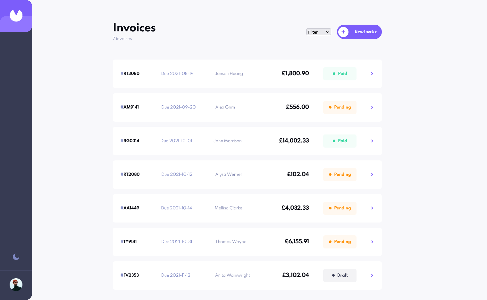

# Frontend Mentor - Invoice app solution

This is a solution to the [Invoice app challenge on Frontend Mentor](https://www.frontendmentor.io/challenges/invoice-app-i7KaLTQjl). Frontend Mentor challenges help you improve your coding skills by building realistic projects.

## Table of contents

- [Overview](#overview)
  - [The challenge](#the-challenge)
  - [Screenshot](#screenshot)
  - [Links](#links)
- [My process](#my-process)
  - [Built with](#built-with)
  - [What I learned](#what-i-learned)
  - [Continued development](#continued-development)
  - [Useful resources](#useful-resources)
- [Author](#author)

## Overview

### The challenge

Users should be able to:

- View the optimal layout for the app depending on their device's screen size
- See hover states for all interactive elements on the page
- Create, read, update, and delete invoices
- Receive form validations when trying to create/edit an invoice
- Save draft invoices, and mark pending invoices as paid
- Filter invoices by status (draft/pending/paid)
- Toggle light and dark mode
- **Bonus**: Keep track of any changes, even after refreshing the browser (`localStorage` could be used for this if you're not building out a full-stack app)

### Screenshot

### Links

- Solution URL: [https://github.com/kpav33/invoice-app](https://github.com/kpav33/invoice-app)
- Live Site URL: [https://kpav33-inovice-app.netlify.app/](https://kpav33-inovice-app.netlify.app/)

## My process

### Built with

- Semantic HTML5 markup
- CSS custom properties
- Flexbox
- CSS Grid
- Mobile-first workflow
- [React](https://reactjs.org/) - JS library
- React Router
- [Styled Components](https://styled-components.com/) - For styles

### What I learned

Main thing I learned from working on this project is that I am capable of completing a complex project quite fast, if I really need to. It took me about 9 days to complete the app, but the downside of completing it quickly is that my code quality is bad and I didn't always follow the provided design of the app.

### Continued development

This project is very much still a work in progress. The reason why I rushed with building it, is because I purchased the Frontend Mentor Pro subscription which expires on 16.09.2021 and I wanted to finish and submit the project until that date. Because I ended up being more busy as I thought I would be in August and September of 2021, when my Pro subsrciption was active, I ended up only being able to spend about a week working on this project, hence why it was so rushed.

I am planning on making considerable changes to this app. Not only in styling to make it more inline with the design, but also overall refactoring of the code, which is right now very confusing and overall of bad quality in my opinion.

### Useful resources

- I found that completing the [Todo App challenge](https://www.frontendmentor.io/challenges/todo-app-Su1_KokOW) and the [REST Countries API with color theme switcher challenge](https://www.frontendmentor.io/challenges/rest-countries-api-with-color-theme-switcher-5cacc469fec04111f7b848ca) was very useful preparation for completing the Invoice app challenge.

## Author

- Frontend Mentor - [@kpav33](https://www.frontendmentor.io/profile/kpav33)
